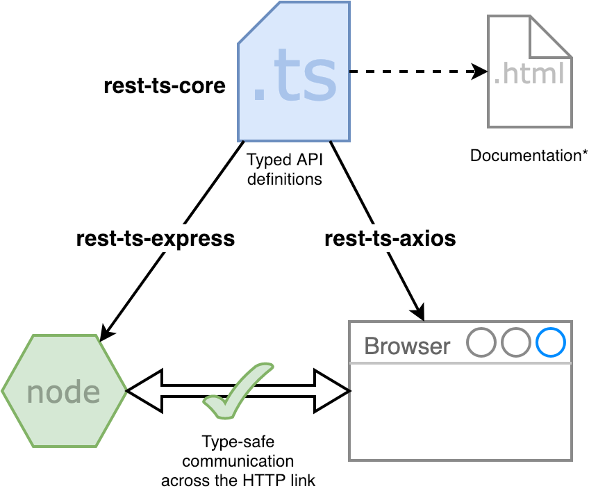

#  Rest.ts    

Type safety across REST APIs in TypeScript!

## What is this?

Rest.ts lets you write API contracts that tie together consumers and producers within the type system. Out of the box, Rest.ts gives you the following features:
- Auto-completion / intelliSense
- Easy code navigation

  
*_It would be possible to generate swagger-style API docs from rest.ts definitions, but this feature has not been created yet. Contributors welcome!_

## Guides

If you are just getting started, read the five minutes [**quick start**](https://github.com/hmil/rest.ts/wiki/Quick-Start) guide to get up to speed.

You will find [**all guides** in the wiki](https://github.com/hmil/rest.ts/wiki).

## API documentation

If you are looking for advanced features, you might want to take a look at the API documentation for the module you are using:

- [rest-ts-core](http://code.hmil.fr/rest.ts/modules/rest_ts_core.html)
- [rest-ts-express](http://code.hmil.fr/rest.ts/modules/rest_ts_express.html)
- [rest-ts-axios](http://code.hmil.fr/rest.ts/modules/rest_ts_axios.html)

## Compatibility

Compatibility between rest.ts and runtypes:

|Rest.ts  |  Runtypes
|---------|----------
|< 0.6.0  |  2.x.x
|>=0.6.0  |  4.x.x

## Contributing

This is an open source project maintained for free on a human being's spare time. It can only be as good as its user community is willing to make it. 
- If you use this project, star it. It helps to get an idea of how many users there are.
- If something is not working, figure out why. If you can, share your findings in a new issue. If you can't, share your findings in a new issue.
- If something is missing, open an issue to spark the discussion.

## Related work

You may also be interested in [RESTyped](https://github.com/rawrmaan/restyped), which fulfills the same role as Rest.ts, but with a different take on the problem.  
**See [Rest.ts vs RESTyped](https://github.com/hmil/rest.ts/wiki/Rest.ts-vs-RESTyped) to chose which one best suits your requirements.**
